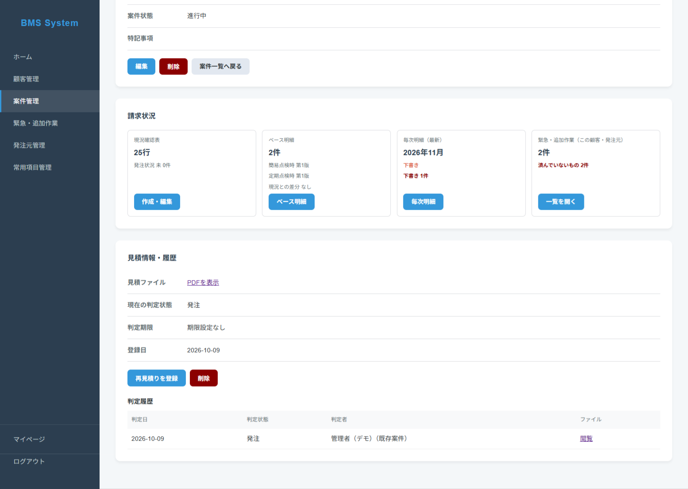
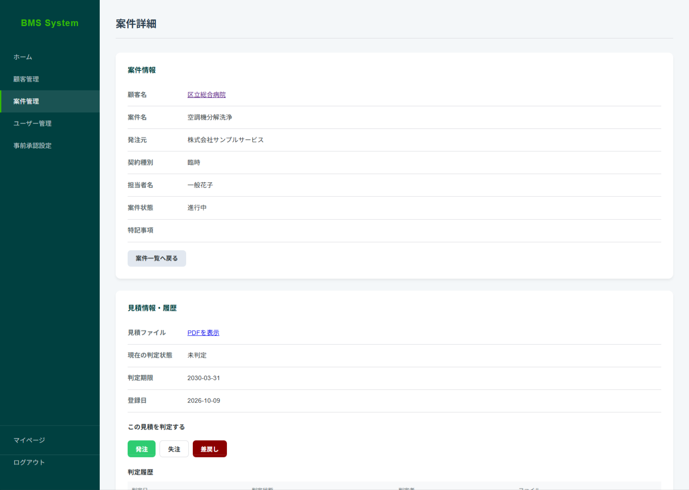
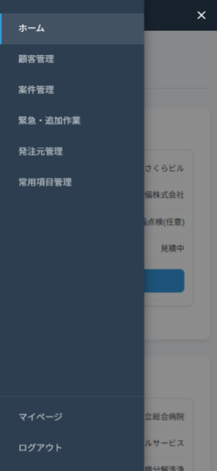
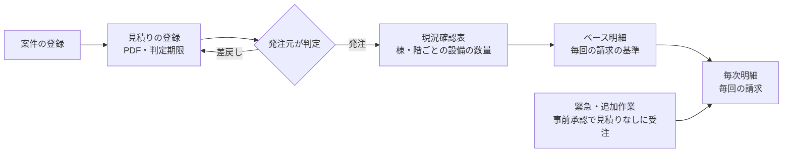
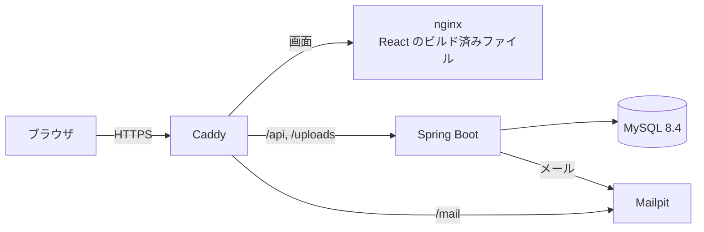
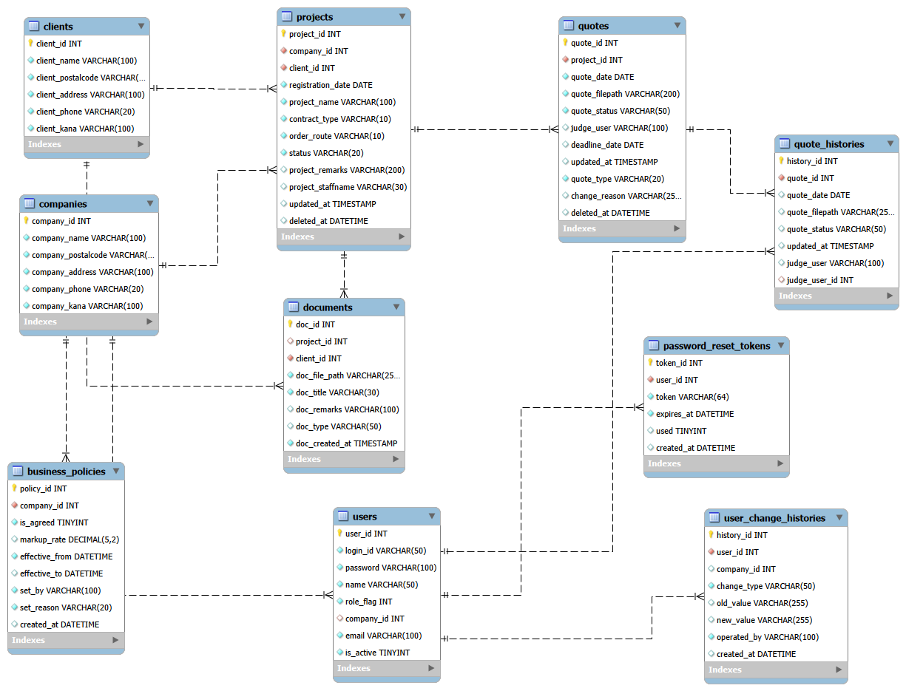
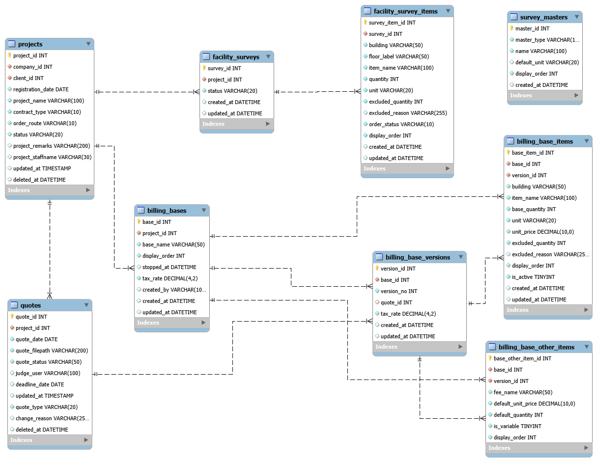
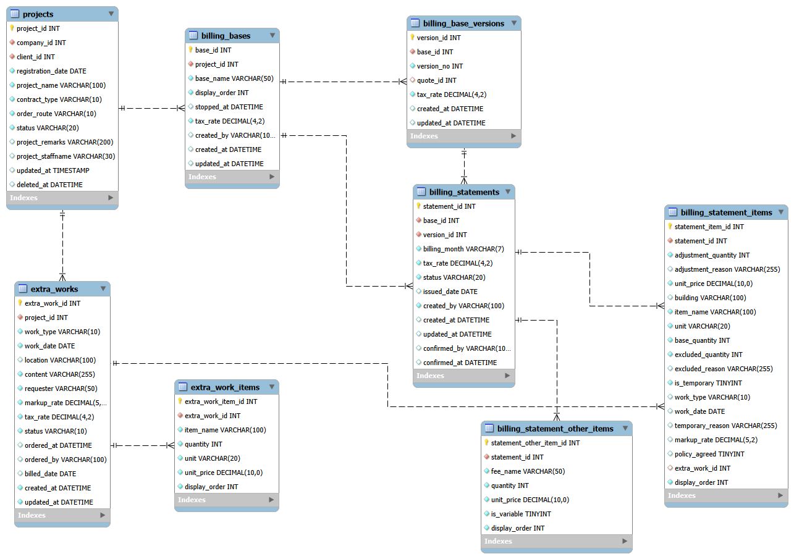

# BMS System

業務データ共有を効率化、透明化。
データ管理機能を１つに集約し、『共有負担』をゼロにする業者間データ管理プラットフォームです。

建物の設備管理の仕事で、**発注元**と**作業する自社**のあいだでやり取りする
見積り・設備の数量・毎回の請求明細を、1つのシステムで共有・管理します。

**▶ デモ：https://bms-system.net/login**
（ログイン画面のボタンから、パスワードなしで3つの立場を試せます）

| 管理者（自社）の案件詳細 | 発注元の案件詳細 |
|---|---|
|  |  |

<p align="center">
  <br>
  スマホ・タブレットでは ☰ メニュー
</p>


---

## 目次
- [デモの試し方](#デモの試し方)
- [業務の流れ](#業務の流れ)
- [主な機能](#主な機能)
- [技術スタック](#技術スタック)
- [システム構成](#システム構成)
- [工夫した点](#工夫した点)
- [リポジトリ構成](#リポジトリ構成)
- [ローカルで動かす](#ローカルで動かす)
- [設計資料](#設計資料)
- [今後の改善予定](#今後の改善予定)
- [開発の背景](#開発の背景)
- [生成AIの活用について](#生成aiの活用について)

---

## デモの試し方

| ボタン | 立場 | できること |
|---|---|---|
| 管理者として試す | 自社の担当者 | 見積り・現況確認表・ベース明細・毎次明細を作る |
| 発注元（代表）として試す | 発注元の代表 | 見積りの判定・事前承認の設定・自社ユーザーの管理 |
| 発注元（一般）として試す | 発注元の一般ユーザー | 見積りの判定・明細の閲覧 |

- データは**毎晩3時**に初期状態へ戻ります。自由に登録・削除して試してください。
- メール（パスワード再設定・ユーザーの招待など）は外に送らず、
  [メールの確認画面](https://bms-system.net/mail/) で見られます。
- PC・タブレット・スマホのどれでも使えます。

## 業務の流れ



- 現況確認表・ベース明細・毎次明細は、設備の数が多い案件だけで作ります（すべての案件で必須ではありません）。
- 緊急・追加作業は、発注元があらかじめ設定した「事前承認」の範囲で、見積りを通さずに受注できます。

## 主な機能

**管理者（自社）**
- 顧客・発注元・案件の管理（案件は削除しても、あとで復元できる）
- 見積り PDF の登録・再見積り・削除と復元、過去の受注の確認
- 現況確認表：棟・階・設備ごとの数量の入力（元に戻す／やり直し、保存前の変更内容の確認）
- ベース明細：1つの案件に複数のベース、「訂正（上書き）」と「改版（新しい版）」の使い分け、版ごとの差分の表示
- 現況確認表とベース明細の差の自動検出（ダッシュボードに警告を表示）
- 毎次明細：ベース明細をコピーして作成、減額の調整、確定・発行日
- 緊急・追加作業：顧客向けのプレビュー、受注、毎次明細への取り込み
- 常用項目（設備名・単位などの入力候補）の管理、顧客の資料のアップロード

**発注元**
- 見積りの判定（発注・失注・差戻し）と、判定期限の管理
- 事前承認の設定（緊急・追加作業の加算割合）※代表のみ
- 自社ユーザーの管理（招待・権限・利用停止）※代表のみ
- ベース明細・毎次明細・緊急・追加作業の閲覧

**共通**
- ログイン・パスワード再設定（メール）・マイページ

## 技術スタック

| 分類 | 技術 |
|---|---|
| フロントエンド | React 19 / React Router 7 / Jotai / axios / Vite 8 / oxlint |
| バックエンド | Java 21 / Spring Boot 4.0 / MyBatis / Bean Validation / Spring Mail |
| データベース | MySQL 8.4 |
| 認証 | セッション認証、パスワードは BCrypt で変換して保存 |
| インフラ | さくらの VPS（Ubuntu）/ Docker Compose / Caddy（HTTPS を自動化）/ nginx / Mailpit |
| CI/CD | GitHub Actions → GitHub Container Registry → VPS へ自動で反映 |

## システム構成



**公開の流れ**：`master` に push → GitHub Actions が Docker イメージを作って GHCR に置く → SSH で VPS に反映

## 工夫した点

- **立場ごとに API を分ける**：管理者用は `/api/...`、発注元用は `/api/contractee/...` に分け、発注元の画面からは発注元用の API だけを使います。
- **請求の基準を「版」で管理**：ベース明細は入力ミスの「訂正」と、内容の変更による「改版」を分けました。数量・項目・税率が変わったときは、改版をおすすめする表示を出します。
- **データの食い違いに気づける**：現況確認表とベース明細の差を自動で数え、ダッシュボードと明細の画面で知らせます。
- **入力の失敗を防ぐ**：未保存のまま画面を離れるときの確認、現況確認表の元に戻す／やり直し、削除の前の確認と復元。
- **画面の幅に合わせた表示**：PC は表、タブレット・スマホはカードで表示します（細かな表示は調整中）。
- **公開環境**：Docker Compose・Caddy（HTTPS）・GitHub Actions による自動反映で構築しました（生成AIの支援を受けて構築し、現在仕組みの理解を深めています）。

## リポジトリ構成

| リポジトリ | 内容 |
|---|---|
| [bms-frontend](https://github.com/a-katsuma/bms-frontend)（ここ） | 画面（React） |
| [BMS-Backend](https://github.com/a-katsuma/BMS-Backend) | API（Spring Boot + MyBatis） |
| bms-deploy（非公開） | 公開環境用の Docker Compose 一式、デモ用データ |

```
bms-frontend/
├── src/
│   ├── api/         # API の呼び出し（機能ごと）
│   ├── atoms/       # 共通の小さな部品・状態（Jotai）
│   ├── components/  # 画面の部品（機能ごとのフォルダあり）
│   ├── hooks/       # 共通の処理（未保存の確認・元に戻す など）
│   ├── pages/       # 画面
│   ├── utils/       # 計算・書式の共通処理
│   ├── App.jsx
│   ├── main.jsx
│   └── router.js
├── public/          # CSS・画像
├── nginx/           # 本番の配信設定
├── docs/            # 設計資料・ローカル用の DB の SQL
└── Dockerfile
```

## ローカルで動かす

**前提**：Git、Java 21、Node.js（LTS）、MySQL 8

**1. クローン**
```bash
git clone https://github.com/a-katsuma/bms-frontend.git
git clone https://github.com/a-katsuma/BMS-Backend.git
```

**2. データベース**
MySQL Workbench で `bms-frontend/docs/bms-systemDB.sql` を開いて実行します
（データベース `project_system_db`・テーブル・デモ用データが作られます）。

**3. バックエンド（BMS-Backend）**
```powershell
# PowerShell の場合
$env:DB_PASSWORD="（MySQL の root のパスワード）"
$env:DEMO_ENABLED="true"
.\mvnw.cmd spring-boot:run
```
`http://localhost:8080` で起動します。メールは送らず、コンソールに表示されます。

**4. フロントエンド（bms-frontend）**
```bash
npm install
npm run dev
```
`http://localhost:3000` を開き、ログイン画面のデモ用ボタンで入れます。

※ デモ用の見積り PDF は含まれていないため、ローカルでは既存の PDF のリンクは開けません（新しく登録した PDF は開けます）。

## 設計資料

### ER 図
**① 基本・見積り・ユーザー**


**② 現況確認表・ベース明細**


**③ 毎次明細・緊急・追加作業**


### API
[API 一覧](./docs/API.md)

### プレゼン資料

-[プレゼン資料 v2.0（PDF）](./docs/プレゼン資料v2.0.pdf)（2026年8月時点。現況確認表・ベース明細・毎次明細・緊急・追加作業など、その後に追加した機能は含みません。）
-[プレゼン資料1（PDF）](./docs/プレゼン資料1.pdf)（2026年6月時点）

## 今後の改善予定

- スマホ表示の改善（メニュー・設備一覧の表示）
- 状態（見積中・発注・差戻しなど）を色付きのラベルで表示する
- Spring Security の導入（認証・権限チェックの共通化）
- CSS をファイルごとに分けて整理する
- 計算処理（合計・差分）とサービス層のテストを追加する

## 開発の背景

空調設備関連の業務のなかで、発注元業者とのやり取りに、次の課題がありました。

- **担当者が変わるたびに、説明が一からやり直しになる**
  発注元で案件のデータや決定事項が引き継がれておらず、担当者が変わるたびに、
  同じデータの提供や、これまでの経緯の説明を繰り返す必要がありました。
- **正しい請求が、不正請求と疑われる**
  見積りの更新や、担当者からの緊急の発注が発注元の請求担当に伝わっておらず、
  正しい請求なのに不正請求を疑われることがありました。
  請求担当が変わると、その説明もまた最初からになります。

どちらも、案件に関わる人が同じ情報を確認できる場所がないことが原因だと考えました。
そこで、案件に関わるユーザーが、システム上で同じ記録を確認できるようにしました。

| 課題 | システムでの対応 |
|---|---|
| 担当者が変わるたびに、データの提供と経緯の説明が必要 | 案件ごとに見積り・判定の履歴・資料・明細を記録し、発注元のユーザーも閲覧できる |
| 見積りの更新が伝わらない | 再見積りと判定の履歴、ベース明細の版の履歴（いつ・何が変わったか）を残す |
| 緊急の発注の根拠が残らない | 発注元の代表があらかじめ「事前承認」の範囲を設定し、その範囲で受けた作業として記録する |
| 請求担当が変わると、請求の説明がやり直し | 毎次明細はベース明細と緊急・追加作業から作られ、請求の根拠をたどれる |

担当者が変わっても経緯の説明に時間を取られず、誰もが実務に集中できる状態を目指しています。

## 生成AIの活用について

設計の相談・コードの提案に生成AI（Claude）を使いました。
提案されたコードは自分で読み、Eclipse・VS Code で反映して動作を確認しています。
